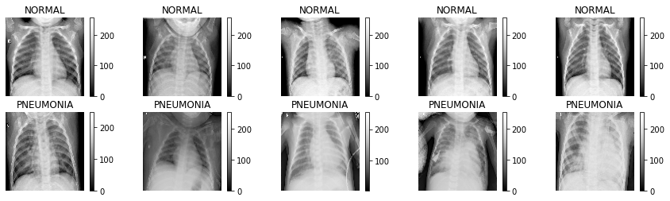
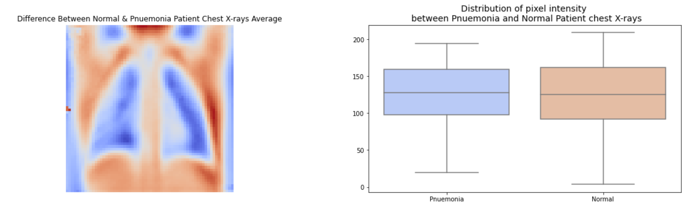
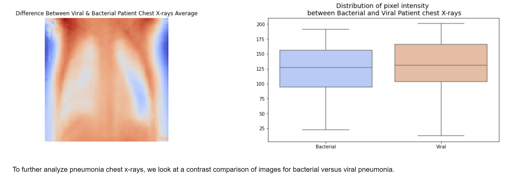
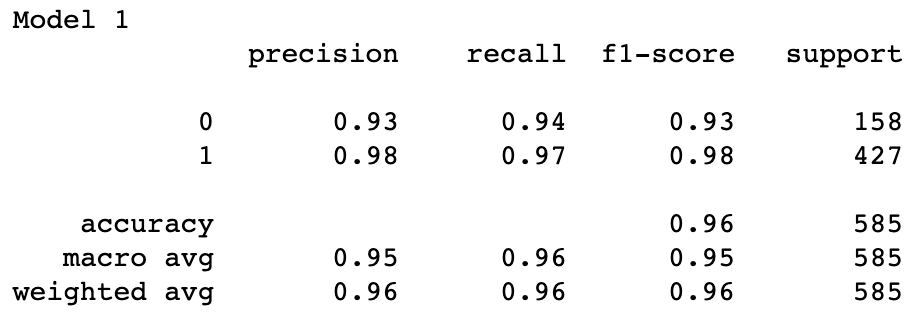
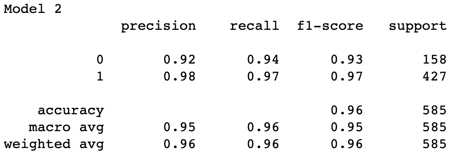
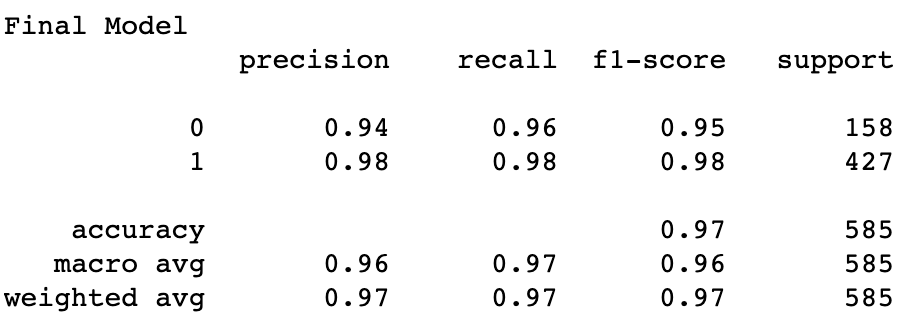

# Pneumonia Classification

### Using convolutional neural networks to identify pneumonia from chest x-rays

**Authors**: [Ijeoma Akamnonu](mailto:inakamno@buffalo.edu) ,[Alexandra Bruno](mailto:alexandrabruno7898@gmail.com)

## Overview 

We built a convolutional neural network to predict the prescence of pneumonia in chest x-rays of children. Due to our business problem, we prioritized recall and accuracy metrics. We were more tolerant towards false positives, but of course did not want to over predict on the pneumonia class, and for this reason we took accuracy metrics into consideration when evalutating our model.

## Business Problem

Those who exam x-rays in order to make a diagonsis are required to obtain years of training. Having a predcitive model that can determine whether an x-ray shows signs of pneumonia can be an extremely powerful too for understaffed health care facilities. This can be a helpful tool for the medical community to consider when resources need to better better allocated. 

## Data 

The data consists of 5,863 x-ray images. The data set shows both baterical and viral pneumonia 

Data split

1. Training set: 4101 images 
2. Validation set: 1170 images 
3. Testing set: 585 images

Looking at 5 random images from both classes, we noticed 2 types on pneumonia infections, bacterial and viral. So, with that, we can isolate these infection types to analyze them further and see if we can find any notable distinguishing features and characteristics.

### Findings 1
Plotting the distribution of pixel intensity, or brightness, will help us clearly see where one class or type is more prominent. The more of that color in that region, the more intense its pixels are in that region. This may suggest some special activity about the disease.

From the pixel intensity distributions shown above, we see that normal chest x-rays have a wider range of pixel intensities but overall, Pneumonia x-rays showed higher intensities. This finding is not surprising to us because as already seen from earlier visualizations, pneumonia x-rays appear cloudier and lighter, or in other words, appear to have a higher intensity.

We are not surprised to see more intense activity coming from the lungs for pneumonia patients, because pneumonia is a respiratory disease.

We can try to assume that normal x-rays have a wider range of pixel intensity due to its more defined, healthy features, but that would be an assumption in need of confirmation using patient age to infer skeletal, organ, and cartilage development.

### Findings 2
To further analyze pneumonia chest x-rays, we look at a contrast comparison of images for bacterial versus viral pneumonia.

Our overall findings show that viral pneumonia may play a bigger role in infection prognosis and diagnosis. However, the spot of blue that we can see in the lungs suggest that Streptococcus pneumoniae, the causing bacteria of pneumococcal pneumonia, is mainly cultivated and most harmful in the lungs compared to a virus. This can be backed up with the common symptoms expressed from these two infections.

Viral infections tend to be drier and rarely cause the buildup of sputum. This piece of information seems to be in slight opposition with our findings. We can see spurts of blue within the red of the lungs. This suggests and confirms our knowledge that bacterial infections cause more mucus and sputum build up, so it would appear cloudier and brighter inside the lungs, where this build up is happening.

## Methodology 

Given the size of the original images we chose to resize them to 256x256x pixels and greyscale the images. 

For running the models we used an Adamn optimizer. The final model consists of 5 two-dimension convolutional layes and maxpooling layers, 2 dropout layers, and a flattening and densely connected layer. Recall and accuracy were the metrics we chose to optimize for this project. 

## Results

### Model 1 

### Model 2

### Final Model 

## Discusiion and Conclusion

The results of the model statisfied what we aimed to do initally, aim to have a high recall and accuracy score. Although the model isn't perfect, given that we had a week to complete the project we think this is a good start. Going forward we would like to implement other optimizers and try different hyperparameters to see if it is possible to improve the model further. 

